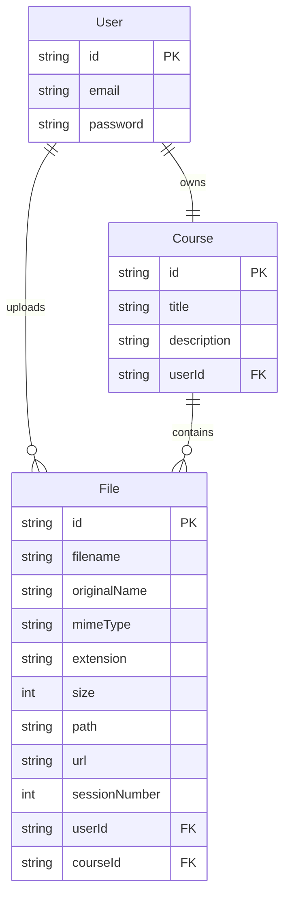

# 📚 Course Stream — Resumable Uploads & Video Streaming for Online Courses

A full-stack platform that lets instructors create courses, upload large video lessons with **resumable, interruption-proof uploads**, and lets students **stream them back on-demand** — powered by the [tus](https://tus.io) protocol and HTTP range requests. Built with a modern TypeScript stack on both ends.


---

## ✨ Why this project?

Uploading large course videos over unreliable connections is painful — a dropped connection usually means starting from zero. This project solves that with **resumable uploads**: if the network drops mid-upload, the client picks up exactly where it left off, no re-upload needed. Once uploaded, videos are served back with **seekable, on-demand streaming** instead of forcing a full download before playback.

- 🔐 **Secure by default** — JWT-based authentication protects every upload and every stream.
- ⏸️ **Resumable uploads** — powered by [`@tus/server`](https://www.npmjs.com/package/@tus/server) on the backend and [Uppy](https://uppy.io) on the frontend.
- 🎬 **On-demand video streaming** — HTTP `Range`-aware streaming endpoint lets students seek anywhere in a video instantly, without downloading the whole file first.
- 🛡️ **Format allow-listing** — only browser-playable formats (`.mp4`, `.webm`) are accepted; anything else is rejected *before* the upload even starts, saving bandwidth.
- 🗂️ **Organized, path-safe storage** — uploaded videos are automatically renamed and sorted into structured folders per course; only relative paths ever touch the database, and physical file paths are never exposed to the client.
- 🧩 **Fully typed** — end-to-end TypeScript, from Prisma models to React components.
- 🧱 **Composable upload pipeline** — a generic `createTusServer` factory lets you spin up new upload endpoints (courses, avatars, attachments, etc.) with custom validation and database logic in just a few lines.

---

## 🏗️ Tech Stack

| Layer | Technology |
|---|---|
| **Backend runtime** | Node.js + Express (TypeScript) |
| **Database ORM** | Prisma (SQLite) |
| **Authentication** | JWT (`jsonwebtoken`) + password hashing (`bcryptjs`) |
| **Resumable uploads** | `@tus/server` + `@tus/file-store` |
| **Video streaming** | Native Node.js `fs.createReadStream` with HTTP `Range` support |
| **Frontend** | React (TypeScript) |
| **Upload client** | [Uppy](https://uppy.io) (`@uppy/core`, `@uppy/tus`, `@uppy/react`) |
| **Video player** | [react-player](https://www.npmjs.com/package/react-player) (v3) |
| **HTTP client** | Axios |

---

## 🗺️ Architecture Overview

```
┌─────────────────┐        JWT Auth         ┌──────────────────────┐
│   React Client   │ ───────────────────────▶│   Express API Server │
│  (Uppy Dashboard) │                          │                      │
└────────┬─────────┘                          └──────────┬───────────┘
         │  Resumable PATCH/POST (tus protocol)           │
         ▼                                                 ▼
┌─────────────────┐                          ┌──────────────────────┐
│  @tus/server     │ ───── on finish ────────▶│   Prisma + SQLite     │
│  (chunked upload)│      rename & validate    │  User / Course / File │
└────────┬─────────┘                          └──────────┬───────────┘
         │                                                 │
         ▼                                                 │
┌─────────────────┐                                        │
│  /storage/*      │  ← final, organized video files       │
└────────┬─────────┘                                        │
         │                                                 │
         │        GET /api/file/stream/:fileId?token=...   │
         ▼                                                 ▼
┌────────────────────────────────────────────────────────────────┐
│   streamFile controller — resolves DB record → relative path    │
│   → absolute path (server-side only) → range-aware byte stream  │
└────────────────────────────┬─────────────────────────────────────┘
                              ▼
                    ┌──────────────────┐
                    │  <ReactPlayer>    │  seekable playback
                    └──────────────────┘
```

**Upload flow in a nutshell:**
1. The client authenticates and receives a JWT.
2. Uppy attempts to start an upload; the server's `onUploadCreate` hook immediately rejects any file whose extension isn't in the allow-list (`.mp4`, `.webm`) — before a single byte is transferred.
3. Uppy uploads the video in chunks to a tus-protocol endpoint, attaching `courseId` and `sessionNumber` as upload metadata.
4. On completion, the server verifies the JWT, validates the target course, renames the file, moves it into `storage/<subfolder>/`, and persists a `File` record (with a **relative** path) linked to both the `User` and the `Course`.

**Streaming flow in a nutshell:**
1. The client requests `GET /api/file/stream/:fileId`, passing the JWT as a query parameter (browsers can't attach custom headers to `<video>`/`<source>` requests).
2. The server looks up the `File` record, resolves its relative path against a fixed `STORAGE_ROOT`, and — depending on whether the client sends an HTTP `Range` header — returns either the full file or just the requested byte range (`206 Partial Content`).
3. `react-player` renders the stream through a native `<video>` element with an explicit `<source type="video/mp4">`, enabling instant seeking without downloading the entire file first.

---

## 📂 Project Structure

```
backend/
├── prisma/
│   └── schema.prisma          # User, Course, File models
├── src/
│   ├── controller/
│   │   ├── authController.ts  # register / login
│   │   ├── courseController.ts
│   │   └── fileController.ts  # tus upload endpoint + range-aware streamFile
│   ├── middleware/
│   │   └── checkAuthentication.ts  # accepts JWT via header OR ?token= query
│   ├── routes/
│   │   ├── authRoutes.ts
│   │   ├── courseRoutes.ts
│   │   └── fileRoutes.ts      # /upload (tus) + /stream/:fileId
│   ├── utils/
│   │   ├── tus.ts             # generic, reusable tus server factory (format allow-list, AsyncLocalStorage result bridge)
│   │   ├── storage.ts         # STORAGE_ROOT + relative <-> absolute path resolution
│   │   ├── CorrectName.ts     # filename/extension helpers
│   │   ├── jwt.ts
│   │   └── prisma.ts
│   └── index.ts
└── uploads/ | storage/         # tus temp storage + final organized files

frontend/
└── src/
    └── component/
        ├── auth/
        │   ├── Register.tsx
        │   └── Login.tsx
        ├── course/
        │   ├── AddCourse.tsx
        │   ├── GetAllCourses.tsx
        │   └── VideoPlayer.tsx  # streams & plays a single file by ID
        └── upload/
            └── UppyDashboard.tsx
```

---

## 🧬 Data Model



---

## 🚀 Getting Started

### Prerequisites
- Node.js **>= 20.19.0**
- npm

### 1. Clone & install

```bash
git clone https://github.com/<your-username>/<your-repo>.git
cd <your-repo>

# backend
cd backend
npm install

# frontend
cd ../frontend
npm install
```

### 2. Configure environment variables

Create a `.env` file inside `backend/`:

```env
PORT=5000
DATABASE_URL="file:./dev.db"
JWT_SECRET="replace-with-a-long-random-secret"
```

### 3. Set up the database

```bash
cd backend
npx prisma migrate dev --name init
npx prisma generate
```

### 4. Run the app

```bash
# backend
cd backend
npm run dev

# frontend (in a separate terminal)
cd frontend
npm run dev
```

The API will be available at `http://localhost:5000` and the frontend at the port your dev server prints (typically `http://localhost:5173` for Vite).

---

## 🔑 API Reference

### Auth

| Method | Endpoint | Description |
|---|---|---|
| `POST` | `/api/auth/register` | Create a new account and receive a JWT |
| `POST` | `/api/auth/login` | Authenticate and receive a JWT |

### Courses

| Method | Endpoint | Auth required | Description |
|---|---|---|---|
| `POST` | `/api/course` | ✅ | Create a course (one per user) |
| `GET` | `/api/course` | ❌ | List all courses with their files |

### File Upload (tus protocol)

| Method | Endpoint | Auth required | Description |
|---|---|---|---|
| `POST` / `PATCH` / `HEAD` / `DELETE` | `/api/file/upload` | ✅ | Resumable video upload endpoint following the [tus protocol](https://tus.io/protocols/resumable-upload) |

Uploads expect the following metadata (sent automatically by Uppy's `meta` option):

```ts
{
  filename: string,
  filetype: string,
  courseId: string,
  sessionNumber: string,
}
```

Only `.mp4` and `.webm` files are accepted. Any other format is rejected immediately in the `onUploadCreate` hook, before any data is transferred.

### Video Streaming

| Method | Endpoint | Auth required | Description |
|---|---|---|---|
| `GET` | `/api/file/stream/:fileId` | ✅ | Streams a video with HTTP `Range` support (seekable playback) |

```
GET /api/file/stream/:fileId?token=<JWT>
```

Since `<video>`/`<source>` elements cannot send custom headers, the JWT is passed as a **query parameter** rather than an `Authorization` header. `checkAuthentication` accepts the token from either source.

The endpoint honors the `Range` request header and responds with `206 Partial Content` for partial requests, or the full file with `200 OK` otherwise — enabling instant seeking in the player instead of buffering from the start every time.

> 🔒 **Security note:** the database only ever stores the file's path *relative* to a fixed `STORAGE_ROOT` on the server. The absolute filesystem path is resolved server-side and is never sent to the client — API responses (e.g. `GET /api/course`) explicitly `select` only client-safe fields (`id`, `originalName`, `mimeType`, `size`, ...), excluding `path` and the internally-generated `filename`.

---

## 🧩 Extending the Upload System

The backend exposes a generic, type-safe factory — `createTusServer<T>()` — so you can spin up new upload pipelines (avatars, assignments, attachments...) without duplicating any tus/file-handling logic:

```ts
const avatarTus = createTusServer<{ isPublic: boolean }>({
  routePath: "/api/file/avatars/upload",
  subfolder: "avatars",
  buildData: async ({ upload }) => ({
    isPublic: upload.metadata?.isPublic === "true",
  }),
  onSaved: async (info) => {
    await prisma.avatarFile.create({ data: info });
  },
});
```

---

## 🛣️ Roadmap

- [x] Resumable, format-restricted video uploads
- [x] Range-aware video streaming with a seekable player
- [ ] Video transcoding to a consistent H.264/AAC MP4 on upload (so any source format can be normalized instead of rejected)
- [ ] Thumbnail generation on upload completion
- [ ] Progress tracking and analytics per student
- [ ] Role-based access control (instructor vs. student)
- [ ] Cloud storage backends (S3 / Azure) via `@tus/s3-store`
- [ ] Course enrollment and payment flow

---

## 🤝 Contributing

Contributions, issues, and feature requests are welcome! Feel free to check the [issues page](../../issues).

---

## 📄 License

This project is licensed under the [MIT License](LICENSE).